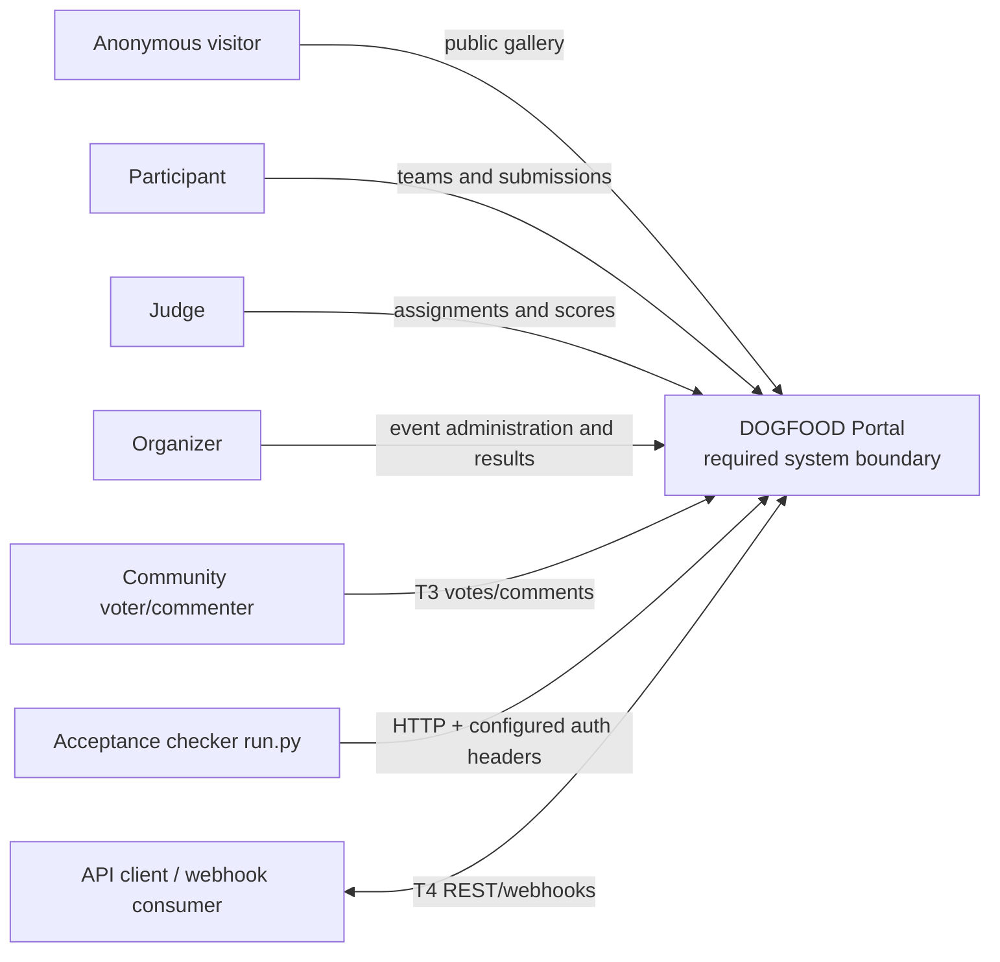
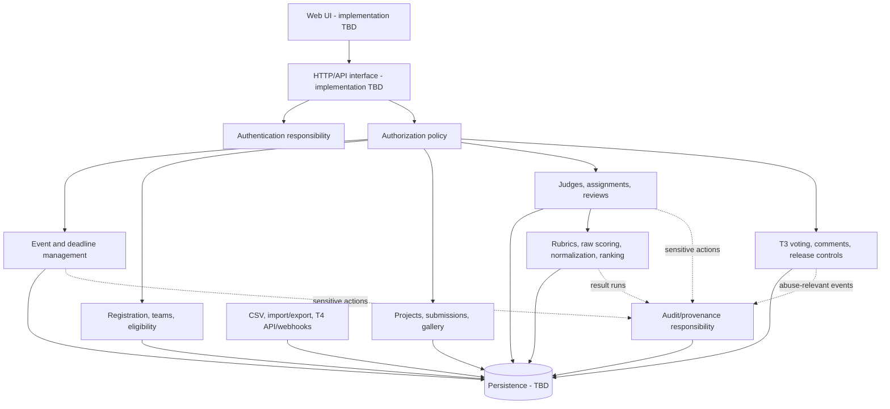
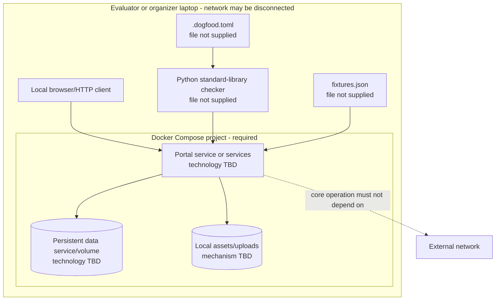
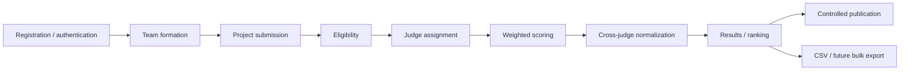
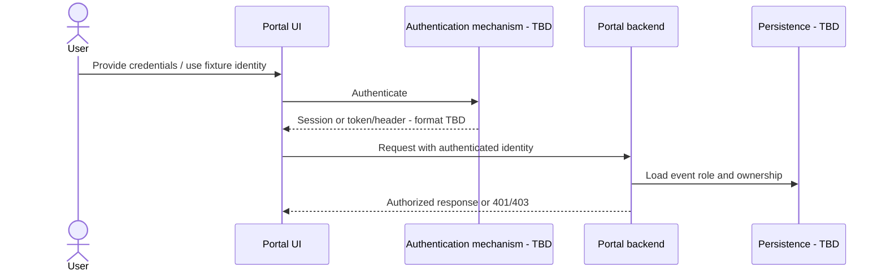
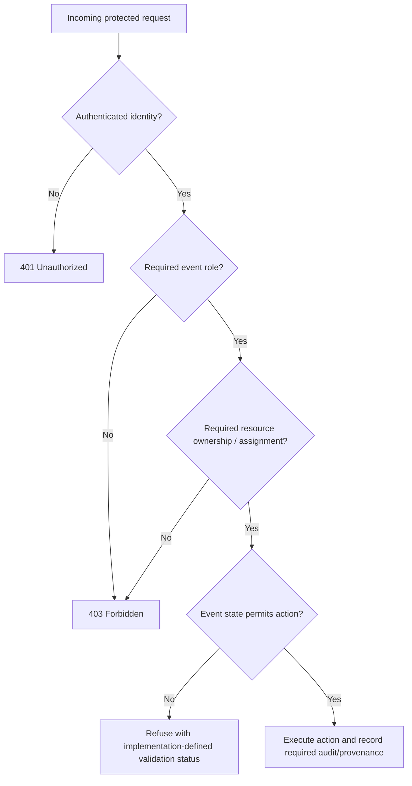
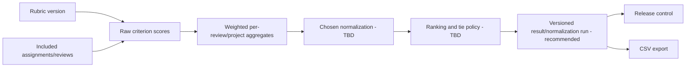

# DOGFOOD Portal — System Architecture

## Architecture status

This is a **requirements and conceptual architecture**. No portal implementation, Compose file, database, or API source is present. Components shown below describe responsibilities required by the source; they do not assert a particular framework, process topology, or database product.

## Architecture goals

1. Support the complete event lifecycle in one product.
2. Enforce authorization and deadline rules on the server.
3. Make judging calculations transparent and reproducible.
4. Start from a seeded state with one Docker Compose command.
5. Operate on a laptop without network access.
6. Make data exportable and the system maintainable by a new operator.
7. Allow T3/T4 capabilities without compromising T1/T2 correctness.

## Architecture principles

- **Correctness before breadth.** A clean T2 is preferred to a broken T4.
- **Backend authority.** The server owns role, ownership, deadline, and release decisions.
- **Explicit provenance.** Raw scores, normalization choices, and result runs should be explainable.
- **Offline by construction.** Core runtime dependencies must not require external services.
- **Implementation neutrality.** Framework, database, and authentication choices remain open.
- **Honest claims.** Documentation and `.dogfood.toml` must match working behavior.

## System context

The acceptance checker and Tier 4 clients are external to the portal. No external runtime service is allowed to be mandatory for core operation.

## Logical components

The source does not require separate deployable services. These are logical responsibilities. The advisory material recommends a modular monolith as a low-risk implementation shape.

## Component responsibilities

| Component | Required responsibility | Status |
|---|---|---|
| Web UI | Present role-appropriate workflows and public gallery | Required capability; technology TBD |
| HTTP/API interface | Serve checker routes and, for T4, documented REST actions | Required/T4; contract incomplete |
| Authentication | Establish organizer, judge, participant, and future API identities | Required; mechanism TBD |
| Authorization | Enforce event role, ownership, and sensitive-resource rules in backend | Required |
| Event management | Event creation, lifecycle windows, `submissions_close`, result release | Required; detailed state model partly recommended |
| Team/eligibility | Registration, team formation, eligibility decisions | Required; policy TBD |
| Project/submission | Draft/submit projects, deadline refusal, gallery | Required |
| Judging | Judge invitation, assignments, review progress, score ownership | Required |
| Scoring/results | Weighted rubric, cross-judge normalization, ranking/results | Required; algorithm/policies TBD |
| Public participation | Voting, comments, randomization, anti-abuse, hidden results | T3 |
| Export/integrations | CSV, bulk import/export, REST, webhooks, embed | T2/T4 |
| Audit/provenance | T3 audit trail and recommended judging/result provenance | Required for T3; broader design TBD |
| Persistence | Store product state locally | Required in practice; technology/schema TBD |

## Runtime architecture

No runtime process topology is specified. A single process, modular monolith, or multiple local services may satisfy the source if Docker Compose starts them and core functionality remains offline.

The advisory recommendation is:

- one web application serving UI and HTTP API;
- one relational database;
- local filesystem or database-backed assets;
- server-side sessions or locally verifiable tokens;
- deterministic seed logic; and
- optional local background processing.

This recommendation is not an implemented decision.

## Deployment architecture

## Main business flow

The source calls this a ten-stage flow but names nine stages. Event creation is the most plausible implicit stage; this remains unresolved.

## Authentication flow

The checker bypasses interactive login: it receives pre-generated working headers from `.dogfood.toml` and attaches them directly.

## Authorization flow

Only the peer-score check specifies exact failure status: `401` or `403`. Other status codes are TBD or defined by the absent checker.

## Submission flow

1. Authenticate participant.
2. Resolve event-scoped participant role and team ownership.
3. Load authoritative event `submissions_close`.
4. Compare server time to the event window.
5. Validate project/submission data.
6. Accept/update before close or refuse after close.
7. Persist state and, if implemented, audit the action.
8. Expose eligible/public project data through the gallery.

Exact boundary semantics at the close instant and edit/finalization rules are TBD.

## Judging flow

1. Organizer establishes judge identities and assignments.
2. Judge authenticates and lists only assigned projects.
3. Judge records scores against weighted criteria.
4. Backend verifies assignment/ownership on every score read/write.
5. Progress dashboard reflects assignment/review states.
6. Normalization consumes the documented set of completed reviews.
7. Result calculation applies documented aggregation, missing-score, zero-variance, and tie policies.
8. Results remain hidden until release policy allows publication.

## Result calculation flow

The weighted and z-score formulas in `main.tex` are advisory examples, not mandated algorithms.

## Export flow

The source requires a working configured CSV route. The route authenticates according to implementation policy, loads a consistent dataset snapshot, serializes valid CSV, and returns it to the checker/operator. Row granularity, columns, ordering, timestamps, and sensitive-field policy are TBD.

## Audit flow

T3 requires an anti-abuse audit trail. Advisory guidance recommends events containing timestamp, actor, role, action, target, outcome, and metadata; sensitive secrets should not be logged. Storage immutability and administrator override policy remain TBD.

## Data flow

| Flow | Inputs | Transformation | Outputs |
|---|---|---|---|
| Fixture seed | `fixtures.json` (absent) | Import exact event/project/judge/track/score data | Seeded local state |
| Submission | Participant identity, team, project data, server time | Ownership/deadline/validation | Submitted or refused project |
| Review | Judge identity, assignment, criterion scores | Authorization and rubric validation | Draft/submitted review and scores |
| Results | Rubric, reviews, normalization policy | Aggregate, normalize, rank | Raw/normalized results |
| Export | Authorized request, selected event data | CSV serialization | CSV response |
| Webhook | T4 domain event | Sign/version/retry (recommended) | External delivery |

## Trust boundaries

1. **Browser/client to backend:** all client input is untrusted.
2. **Role boundary:** participants, judges, organizers, and anonymous users have distinct authority.
3. **Object-ownership boundary:** one judge's score records are private from peer judges.
4. **Event boundary:** roles and resources should be scoped to an event.
5. **Checker boundary:** configured headers are sensitive test credentials.
6. **Webhook/API boundary:** T4 external clients are untrusted until authenticated and authorized.
7. **Persistence boundary:** application code must enforce invariants even if identifiers are supplied by the client.

## External dependencies

- Required at evaluation time: Docker/Docker Compose and the organizer-supplied checker/config/fixture artifacts.
- Required runtime internet dependencies: none allowed for core operation.
- Optional publishing/integration destinations: not part of portal runtime.
- Exact operating-system/container-engine versions: not specified.

## Failure boundaries

| Failure | Required/recommended behavior |
|---|---|
| Authentication absent/invalid | Return 401 for protected requests; exact policy TBD except peer check permits 401/403. |
| Authenticated but unauthorized | Return 403; never disclose peer scores. |
| Closed submissions | Refuse the submission without mutating accepted state. Exact status TBD. |
| Incomplete judging | Progress must reveal it; final-result policy TBD. |
| Zero-variance judge | Normalization must not divide by zero; selected policy must be documented. |
| Duplicate fixture submission | Must be handled/identified without silently distorting results; exact policy TBD. |
| Export serialization | Return valid CSV or a clear failure; exact error contract TBD. |
| Restart | Recommended to preserve state and avoid duplicate seed records. |

## Offline architecture

All application code, assets, database capability, migrations, and seed logic required for core workflows must be locally available. Hosted identity, cloud databases, remote CDNs, and mandatory SaaS APIs are incompatible with the source constraints.

## Scalability considerations

The only dataset size stated is 40 projects, 30 judges, 8 tracks, and a complete score set. No production scale target exists. Architecture must not claim horizontal scaling, high availability, or specific concurrency capacity without future requirements and implementation evidence.

## Architecture tradeoffs

| Decision area | Source position | Tradeoff status |
|---|---|---|
| Modular monolith vs services | Modular monolith recommended for 72 hours | Proposed; not accepted |
| Relational vs other persistence | Relational recommended | Proposed; not accepted |
| Sessions vs tokens | Either local mechanism suggested | TBD |
| Normalization method | Required but deliberately open | Decision required |
| Audit immutability | Audit required for T3; implementation open | Decision required |
| API-first design | Bonus/T4 | Optional/planned |

## Known limitations

1. No application architecture can be verified from code because no code is present.
2. The exact checker protocol is unavailable because `run.py` is missing.
3. The exact fixture schema is unavailable because `fixtures.json` is missing.
4. API, persistence, and authentication diagrams are conceptual.
5. T3/T4 manual evaluation details are incomplete.

## Related decisions

See [ADR/](ADR/) and [DOCUMENTATION_AUDIT.md](DOCUMENTATION_AUDIT.md). ADRs remain Proposed unless a source-defined constraint supports Accepted status.