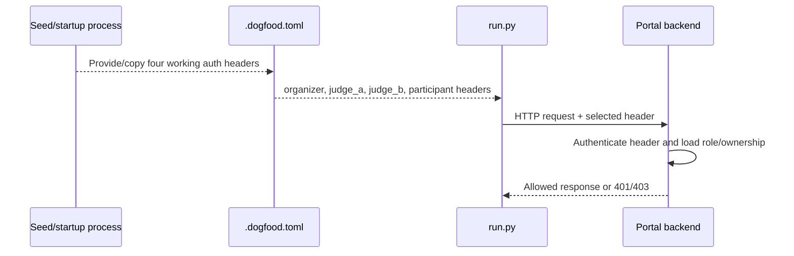

# DOGFOOD Portal — Authentication and Authorization Specification

## Status

Backend authorization is source-defined and critical. The authentication mechanism, session/token design, role storage, and most route contracts are implementation-defined. No application implementation is present.

## Actors

| Actor | Authentication state | Source role |
|---|---|---|
| Anonymous visitor | Unauthenticated | Public gallery consumer |
| Participant | Authenticated | Event participant/team member |
| Judge | Authenticated | Event judge |
| Organizer | Authenticated | Event administrator |
| Acceptance checker | Uses configured actor headers | Acts as organizer, `judge_a`, `judge_b`, or participant |
| Community voter/commenter | TBD | T3 public-participation actor |
| API client/webhook consumer | TBD | T4 integration actor |

## Roles

The source explicitly names organizer, judge, and participant credentials in `.dogfood.toml`. Roles should be event-scoped (recommended), but the storage model is not specified. Anonymous access is required for the gallery.

## Critical invariants

| ID | Invariant | Source status |
|---|---|---|
| AZ-001 | The gallery is accessible without authentication. | Source-defined |
| AZ-002 | A participant may perform participant submission behavior only while the event permits it. | Source-defined; ownership detail recommended |
| AZ-003 | A judge may retrieve that judge's own score records. | Source-defined acceptance check |
| AZ-004 | A judge may not retrieve another judge's scores through UI or API. | Source-defined critical invariant |
| AZ-005 | `judge_b` requesting `judge_a` scores must receive `401` or `403`; `200` is a failure. | Source-defined exact outcome |
| AZ-006 | A participant is blocked from judge-only scoring behavior/data. | Source-defined acceptance check |
| AZ-007 | Authorization must execute in the backend; frontend control visibility is not authorization. | Source-defined |
| AZ-008 | Protected operations should combine authenticated actor, event-scoped role, resource ownership/assignment, and current event state. | Recommended |

## Permission matrix

`TBD` means the source does not establish the policy.

| Action/resource | Anonymous | Participant | Judge | Organizer | Status |
|---|---|---|---|---|---|
| View public gallery | Allow | Allow | Allow | Allow | Source-defined |
| View fixture projects | Allow | Allow | Allow | Allow | Source-defined through public gallery |
| Register/authenticate | Implementation-defined | Allow | Allow | Allow | Source-defined capability, mechanism TBD |
| Create/manage event | Deny | Deny | Deny | Allow | Source-defined role interpretation |
| Form/join team | Deny | Allow | Deny unless separately participant | Administrative access TBD | Source-defined capability; exact admin policy TBD |
| Create/edit own-team project before close | Deny | Recommended allow | Deny unless separately participant | TBD | Ownership is recommended; exact policy TBD |
| Submit after close | Deny | Deny | Deny | Override TBD | Closed-event refusal source-defined |
| View assigned project | Public data only | Public/own data | Allow when assigned | Allow/TBD | Assignment-scoped judge access inferred |
| Read own judge scores | Deny | Deny | Allow | Organizer policy TBD | Source-defined for judge |
| Read peer judge scores | Deny | Deny | Deny | TBD | Judge denial source-defined; organizer policy unknown |
| Enter/update own assigned review | Deny | Deny | Allow when assigned | Override TBD | Inferred from judging workflow |
| Assign judges/projects | Deny | Deny | Deny | Allow | Source-defined organizer responsibility |
| View progress dashboard | Deny | Deny | Personal progress TBD | Allow | T2 capability; exact judge view TBD |
| Run normalization | Deny | Deny | Deny | Recommended allow | Exact source actor not explicit; organizer inferred |
| Publish results | Deny | Deny | Deny | Recommended allow after release policy | Source requires controlled release; actor inferred |
| CSV export | Deny | Deny | TBD | Recommended allow; checker must access configured route | Exact policy TBD |
| Community vote/comment | T3 policy TBD | T3 policy TBD | T3 policy TBD | Moderate/admin TBD | Identity policy unspecified |
| Configure API/webhooks | Deny | Deny | Deny | Recommended allow | T4; exact policy TBD |

## Resource ownership

### Project ownership

Advisory guidance states that team membership should determine submission ownership. Requests must not become authorized merely because they contain another team's ID. Exact team membership and organizer override rules are TBD.

### Judge review/score ownership

Judge ownership is the critical object-level rule. The backend must derive the authenticated judge identity and restrict access to score records owned by/assigned to that judge. A query parameter such as `?judge=judge_a` selects a target; it does not grant access.

### Event scoping

Recommended: roles, teams, projects, assignments, and permissions are scoped to an event. Cross-event access rules are not specified and require implementation tests.

## Authentication flow

The source permits any authentication implementation. The checker does not log in interactively.

The sample uses `Cookie: session=...`, but cookies are examples. Header format, credential generation, expiration, revocation, and storage are TBD.

## Authorization flow

1. Authenticate the request.
2. Resolve the actor's event role.
3. Resolve resource ownership or assignment where required.
4. Resolve current event state/deadline/release window.
5. Allow or deny before reading or mutating protected data.
6. Record audit/provenance where required or adopted.

## Protected resources

- judge scores and reviews;
- judge assignments;
- participant/team-owned drafts and submissions;
- event administration;
- judging progress;
- normalization/result runs;
- unpublished results;
- CSV/bulk exports where sensitive;
- audit events;
- webhook/API credentials;
- certificate/verifiable judge record operations if implemented.

## Failure responses

- Peer-score test: exact allowed failures are `401 Unauthorized` or `403 Forbidden`; `200` fails.
- Other protected routes: 401 for unauthenticated and 403 for authenticated-but-forbidden is recommended, but exact checker assertions are unavailable.
- Denials should not disclose whether a protected peer record exists (recommended).
- Deadline/validation refusal status is TBD and must follow `run.py` once supplied.

## Session/token behavior

Not specified. Required properties:

1. Works offline.
2. Produces four usable checker headers.
3. Reliably maps to the correct role/identity.
4. Cannot be manipulated to select a different judge or participant.

Recommended properties include random secrets, scoped cookies/tokens, expiration/revocation, and separation between fixture credentials and production credentials.

## Privilege escalation prevention

Test at least:

- participant → judge route;
- judge → peer judge score;
- participant → another team project;
- judge → organizer action;
- actor in event A → protected resource in event B;
- identifier substitution in path/query/body;
- frontend-hidden action called directly through HTTP;
- stale/revoked fixture/session credential.

## Verification matrix

| Test ID | Scenario | Expected |
|---|---|---|
| TC-AUTHZ-001 | `judge_a` requests own scores | Allowed; exact success schema/status defined by checker/implementation |
| TC-AUTHZ-002 | `judge_b` requests `judge_a` scores | `401` or `403`; never score data |
| TC-AUTHZ-003 | Participant requests judge score behavior/data | Denied; exact status defined by checker |
| TC-AUTHZ-004 | Anonymous requests gallery | Allowed |
| TC-AUTHZ-005 | Participant changes another team/project identifier | Denied (recommended ownership rule) |
| TC-AUTHZ-006 | Judge calls organizer-only action | Denied |
| TC-AUTHZ-007 | Request crosses event boundary | Denied (recommended event scoping) |

## Open decisions

Authentication library/mechanism, organizer access to judge scores, team ownership rules, multi-role users, role grant/revoke behavior, session lifetime, CSRF protections for cookie sessions, API client scopes, community voter identity, and exact failure formats.