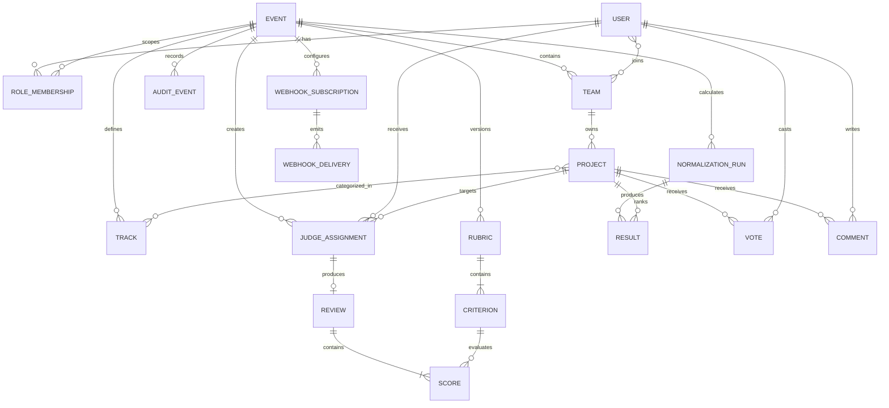
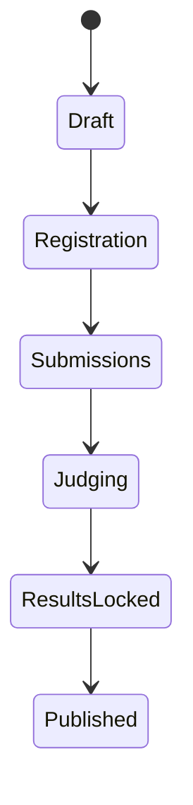
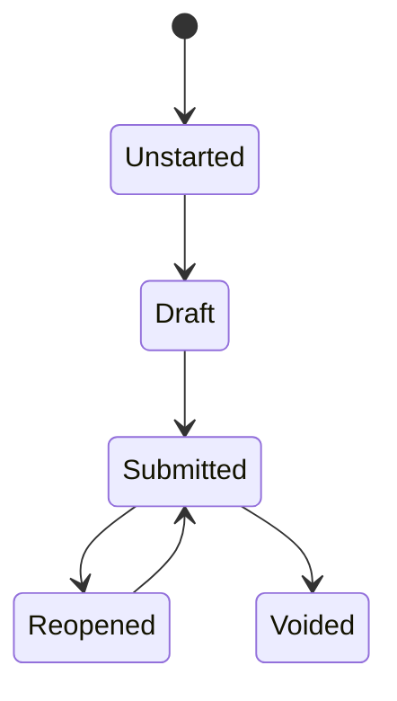

# DOGFOOD Portal — Data Model Specification

## Status

No database schema, migrations, ORM models, or `fixtures.json` are present. This document defines the **conceptual domain model** extracted from source requirements and advisory material. Field names and data types are implementation-defined unless explicitly noted.

## Modeling rules

- Every entity requires an implementation-selected stable primary key.
- Event-specific roles and resources should be scoped to an event.
- Client-provided ownership identifiers must not grant authorization.
- Authoritative event times should be stored/compared in UTC (recommended).
- `submissions_close` is the only exact source field name required by fixture/checker guidance.
- Actual fixture field names and JSON schema are unknown because the file is absent.

## Conceptual ER diagram

Vote, Comment, Webhook, Certificate, and Verifiable Judge Record entities apply only when the corresponding T3/T4 feature is implemented.

## Entity catalog

### User

| Property | Specification |
|---|---|
| Purpose | Represents an authenticated person or fixture identity. |
| Source fields | `id`, display name, credential/session data are advisory examples. |
| Data types | TBD. Primary key type TBD. |
| Required fields | Stable ID and authentication linkage are required in practice; exact fields TBD. |
| Unique constraints | Credential/login identifier uniqueness TBD. |
| Relationships | Roles, teams, assignments, votes, comments, audit actions. |
| Lifecycle | Creation/activation/deactivation rules TBD. |
| Validation | No real identity is required for fixture users. |
| Ownership | A user is the authenticated actor; roles determine event authority. |
| Authorization | Identity alone does not imply role or object ownership. |
| Audit | Sensitive identity/role changes should be auditable. |

### Event

| Property | Specification |
|---|---|
| Purpose | Defines one hackathon and its lifecycle windows. |
| Source fields | Title/status and open/close/release timestamps are advisory; `submissions_close` is explicitly referenced. |
| Data types | IDs/status/timestamps TBD; timestamps should be UTC instants (recommended). |
| Primary key | TBD. |
| Required fields | At minimum an identity and `submissions_close` are required for acceptance behavior. |
| Unique constraints | TBD. |
| Relationships | Roles, teams, projects, tracks, rubric, assignments, runs, audits. |
| Lifecycle | Draft → registration → submissions → judging → results locked → published is recommended, not mandated. |
| Validation | Closing/release windows should be internally consistent; exact rules TBD. |
| Ownership | Organizer-managed. |
| Authorization | Event role scopes all protected behavior. |
| Audit | Window/rubric/result-release changes should be recorded (recommended). |

### RoleMembership

| Property | Specification |
|---|---|
| Purpose | Associates a user with an event-scoped role. |
| Fields | `user_id`, `event_id`, `role`; exact names/types TBD. |
| Primary key | Composite or surrogate key TBD. |
| Foreign keys | User and Event. |
| Required fields | User, event, role. |
| Unique constraints | Recommended uniqueness on user + event + role. |
| Roles | Organizer, Judge, Participant; anonymous is unauthenticated rather than a stored role. |
| Lifecycle | Grant/revoke rules TBD. |
| Authorization | Core input to backend policy. |
| Audit | Grants/revocations should record actor/time. |

### Team

| Property | Specification |
|---|---|
| Purpose | Groups participants and owns submissions/projects. |
| Fields | Event, name, members are advisory; IDs/types TBD. |
| Relationships | Event, users/members, projects. |
| Required/optional | Event and stable identity required; name/member rules TBD. |
| Unique constraints | Team-name uniqueness is not specified. |
| Lifecycle | Formation, joining, leaving, locking rules TBD. |
| Ownership | Membership determines allowed participant project operations (recommended). |
| Audit | Membership changes should be auditable where they affect ownership. |

### Project / Submission

The source uses both project and submission concepts and reports a duplicate submission edge case. Whether these are one entity or separate versioned entities is an implementation decision.

| Property | Specification |
|---|---|
| Purpose | Represents a team's hackathon entry and its submitted state. |
| Fields | Team, title, description, links, status, submitted timestamp are advisory. |
| Primary/foreign keys | TBD; must relate to owning team and event, directly or transitively. |
| Required fields | Exact project payload is unknown. |
| Unique constraints | Duplicate definition/policy TBD. |
| Relationships | Team, tracks, assignments, votes, comments, results. |
| Lifecycle | Draft/submitted/late-refused/eligible/ineligible/withdrawn are recommended states, not source-mandated schema values. |
| Validation | Team ownership and server-side deadline enforcement required. |
| Authorization | Public read through gallery; participant writes limited to owning team; judge read limited to assignments where applicable. |
| Audit | Submission and eligibility transitions recommended. |

### Track

| Property | Specification |
|---|---|
| Purpose | Categorizes projects; fixtures reportedly contain eight tracks. |
| Fields/types | Event, name, stable ID; exact schema TBD. |
| Relationships | Event and projects. |
| Constraints | Number and naming come from absent fixtures. |
| Authorization/audit | Organizer-managed; changes after assignment/results should be controlled. |

### Rubric

| Property | Specification |
|---|---|
| Purpose | Groups weighted judging criteria. |
| Fields | Event, version/status are recommended; exact schema TBD. |
| Relationships | Event and criteria. |
| Lifecycle | Freezing or versioning after judging starts is recommended. |
| Validation | Must contain weighted criteria; empty-rubric behavior must be defined. |
| Authorization | Organizer-managed; judge reads relevant version. |
| Audit | Changes affecting results should record provenance. |

### Criterion

| Property | Specification |
|---|---|
| Purpose | Defines one weighted scoring dimension. |
| Fields | Label, description, scale, weight, order are recommended. |
| Data types | Numeric scale/weight types and precision TBD. |
| Required fields | Weight is source-required; remaining exact fields TBD. |
| Validation | Non-negative/meaningful weight validation recommended; score bounds TBD. |
| Relationships | Rubric and scores. |
| Audit | Criterion/weight changes should be versioned or audited. |

### JudgeAssignment

| Property | Specification |
|---|---|
| Purpose | Assigns a judge to a project, possibly within a review batch. |
| Fields | Judge/user, project, batch, state are advisory. |
| Foreign keys | User/Judge, Project, Event; batch relation if modeled separately. |
| Required fields | Judge and project. |
| Unique constraints | Duplicate assignment policy TBD. |
| Lifecycle | Assigned/in-progress/completed/reassigned states TBD. |
| Authorization | Establishes judge access to the project/review, but never peer-score access. |
| Audit | Assignment/reassignment recommended. |

### ReviewBatch

| Property | Specification |
|---|---|
| Purpose | Groups judging work; fixtures reportedly contain two unfinished batches. |
| Fields/types | Exact schema absent. |
| Relationships | Event, assignments, judges. |
| Lifecycle | Completion policy TBD. |
| Validation | Incomplete batches must remain visible rather than becoming zero scores. |
| Audit | Reassignment/completion changes recommended. |

### Review

| Property | Specification |
|---|---|
| Purpose | Represents a judge's review for one assignment/project. |
| Fields | Assignment, state, comments, submitted/reopened/voided timestamps are recommended. |
| Relationships | One assignment; multiple criterion scores. |
| Lifecycle | Unstarted/draft/submitted/reopened/voided is recommended. |
| Validation | Missing-criterion policy TBD. |
| Ownership | Owned by the assigned judge for ordinary judge access. |
| Authorization | Peer judges must not read its scores. Organizer access policy TBD. |
| Audit | Submit/reopen/void operations recommended. |

### Score

| Property | Specification |
|---|---|
| Purpose | Stores one criterion value within a review. |
| Fields | Assignment/review, criterion, numeric value, optional comment, timestamps are advisory. |
| Data types | Numeric precision and comment type TBD. |
| Required fields | Value requirement depends on missing-score policy. |
| Unique constraints | Recommended uniqueness per review + criterion. |
| Validation | Criterion bounds, weight application, and missing handling TBD. |
| Ownership | Inherits review/judge ownership. |
| Authorization | Critical peer-score isolation applies. |
| Audit | Changes after submission should be recorded. |

### NormalizationRun

| Property | Specification |
|---|---|
| Purpose | Captures one reproducible cross-judge normalization/result calculation. |
| Fields | Event, method, version, parameters, timestamp are advisory. Recommended provenance also includes included inputs, initiator, outputs, and warnings. |
| Data types | TBD. |
| Relationships | Event, rubric/reviews, results. |
| Lifecycle | Created/finalized/published policy TBD. |
| Validation | Must handle zero-variance judge under documented policy. |
| Authorization | Organizer initiation assumed by guidance; exact policy TBD. |
| Audit | Run metadata is itself provenance. |

### Result

| Property | Specification |
|---|---|
| Purpose | Associates a project with raw/normalized values and ranking for a run. |
| Fields | Raw aggregate, normalized aggregate, rank, tie metadata are recommended. |
| Relationships | Project and NormalizationRun. |
| Validation | Tie, missing-review, and provisional/final policy TBD. |
| Authorization | Hidden until release where T3 applies. |
| Audit | Publication and recalculation should be traceable. |

### Vote

| Property | Specification |
|---|---|
| Purpose | Tier 3 community vote. |
| Fields | Voter identity/fingerprint, project, timestamp, status are advisory. |
| Data types/keys | TBD. |
| Unique constraints | One-vote/deduplication rule TBD. |
| Validation | Deadline and anti-abuse policy required. |
| Authorization | Identity policy TBD. |
| Audit | Required as part of T3 anti-abuse audit trail. |

### Comment

| Property | Specification |
|---|---|
| Purpose | Tier 3 project comment. |
| Fields/types | Not specified. |
| Relationships | Author and Project. |
| Validation/moderation | TBD. |
| Authorization | TBD. |
| Audit | Abuse/moderation audit recommended. |

### AuditEvent

| Property | Specification |
|---|---|
| Purpose | Supports T3 anti-abuse evidence and recommended sensitive-change provenance. |
| Fields | Event ID, timestamp, actor, role, action, target type/ID, outcome, metadata; reason and old/new summary for sensitive changes are recommended. |
| Data types | TBD; metadata format TBD. |
| Constraints | Ordinary users should not rewrite audit history (recommended). |
| Sensitive data | Must avoid secrets/tokens and unnecessary personal data (recommended). |
| Lifecycle/retention | TBD. |

### APIClient, WebhookSubscription, WebhookDelivery

These are advisory Tier 4 entities. Suggested fields include event, client identity/secret/scope, endpoint, event type, delivery ID, signature/timestamp, attempt count, state, and error information. Exact schema, secret storage, retry, replay, and retention policies are TBD.

### Certificate and VerifiableJudgeRecord

The source names these T4 capabilities but defines neither their data nor verification model. Their schemas are **Unknown / TBD** and must not be inferred as implemented.

## Relationship descriptions

1. Users receive event-scoped roles.
2. Participants join teams; teams own projects/submissions.
3. Events define tracks and one or more rubric versions.
4. Judges receive assignments to projects.
5. Reviews and criterion scores belong to assignments/judges.
6. Normalization runs consume a documented set of reviews and produce per-project results.
7. Tier 3 votes/comments target projects and produce audit-relevant events.
8. Tier 4 integrations are event-scoped.

## State transitions

### Event (recommended)

### Review (recommended)

### Project/submission

No authoritative state machine is specified. Draft, submitted, refused, eligible, ineligible, withdrawn, and duplicate-flagged are recommended concepts requiring a decision.

## Timestamp and timezone policy

- Source-defined: use the fixture's exact `submissions_close` value.
- Recommended: store authoritative instants in UTC, compare on the backend, and display timezone explicitly.
- Unknown: timestamp precision, inclusive/exclusive close boundary, database type, and serialization format.

## Migration considerations

No migration tooling or schema version exists. The future implementation should document schema creation, upgrade, rollback, fixture compatibility, and how rubric/result provenance survives schema changes.

## Fixture/seed behavior

Reported fixture facts: 40 projects, 30 judges, 8 tracks, a complete score set, one constant-scoring judge, two unfinished review batches, a duplicate submission, and no real names. The actual JSON structure, IDs, team count, field names, and score schema cannot be documented until `fixtures.json` is supplied.

## Unresolved model decisions

See [DOCUMENTATION_AUDIT.md](DOCUMENTATION_AUDIT.md): database technology, key strategy, team membership rules, project/submission separation, duplicate semantics, eligibility, rubric versioning, score precision, review states, tie policy, audit immutability, certificate semantics, and fixture schema remain open.