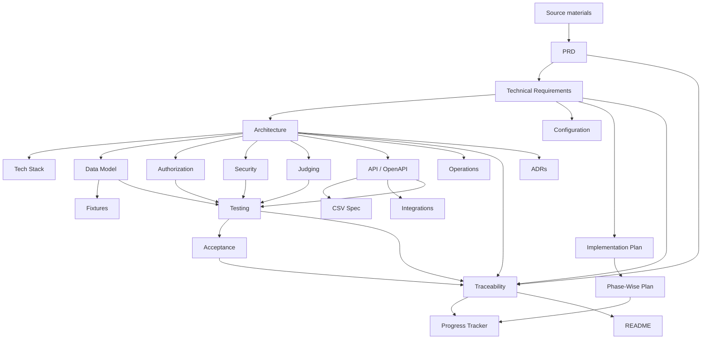

# DOGFOOD Portal — Documentation Coverage and Consistency Audit

## Audit scope

This audit covers all supplied repository materials and the generated documentation suite as of Sunday, September 27, 2026.

## Source register

| Source | Status | Authority/use |
|---|---|---|
| `main.tex` | Present; read completely | Canonical consolidated handbook. Sections labeled official are normative; sections labeled implementation guidance are advisory. |
| `proofrank_solution.tex` | Present; read/compared | Earlier/composite version of the same handbook; inputs appendix after its original content. No independent implementation. |
| `proofrank_appendix.tex` | Present; read/compared | Advisory workflows, judging, security, API, operations, and testing guidance; embedded in `main.tex`. |
| `longtable-finite-glue.sty` | Present; read completely | Documentation-build compatibility patch only. |
| Original kickoff PDF | Present | Upstream event brief summarized/expanded by LaTeX sources. |
| `fixtures.json` | Missing | Referenced source; exact dataset/schema cannot be analyzed. |
| `run.py` | Missing | Authoritative executable acceptance protocol unavailable. |
| `.dogfood.toml` | Missing | Sample format known; actual values unavailable. |
| Docker Compose/application source | Missing | No implementation can be verified. |
| `main (2).tex` | Missing | Named by request but not found. |

## Documentation coverage report

| Document | Status | Source coverage | Missing information / open issues |
|---|---|---|---|
| `README.md` | Complete for current repository state | Entry point, roles, tiers, architecture/stack/config/test/security index | Must be updated after implementation |
| `docs/PRD.md` | Complete baseline | Product problem, goals, scope, FR-001–030, NFR-001–012, DR-001–009 | Product policies listed in open questions |
| `docs/TECHNICAL_REQUIREMENTS.md` | Complete baseline | TR-001–066 with priority, verification, source | Implementation status unverified; performance targets absent |
| `docs/TECH_STACK.md` | Complete | Actual documentation stack and required interfaces | Application stack undecided |
| `docs/ARCHITECTURE.md` | Complete conceptual document | Goals, components, flows, deployment, trust/failure boundaries, Mermaid diagrams | No runtime implementation topology |
| `docs/DATA-MODEL.md` | Complete conceptual document | All source/advisory entities and states | Actual fields/types/keys/schema absent |
| `docs/AUTHORIZATION.md` | Complete requirements specification | Actors, matrix, object ownership, exact peer isolation | Authentication/session and organizer policy TBD |
| `docs/SECURITY.md` | Complete design threat model | Actual source attack surfaces and advisory controls | No implemented control assessment |
| `docs/JUDGING.md` | Complete domain baseline | Weighted scoring, normalization formulas/examples, edge cases | Assignment/normalization/tie/missing policies TBD |
| `docs/API.md` | Complete honest interface baseline | Five route keys and proposed routes | Methods/schemas/statuses mostly depend on missing checker/implementation |
| `docs/openapi.yaml` | Valid intentional skeleton | Metadata, tags, checker-route extensions | Empty paths until real contract exists |
| `docs/TESTING.md` | Complete strategy | Test pyramid, 28 requirement-linked cases | No framework/tests/CI implemented |
| `docs/ACCEPTANCE.md` | Complete available specification | All seven machine checks | Exact protocol blocked by missing `run.py` |
| `docs/FIXTURES.md` | Complete absence-aware report | All reported counts/edge cases/dependencies | Actual JSON/schema/timestamp absent |
| `docs/CSV-SPEC.md` | Complete minimum/TBD specification | Required route and advisory fields/security | No normative columns/dialect |
| `docs/INTEGRATIONS.md` | Complete inventory | Checker, fixture, CSV, T4 REST/webhooks/bulk/embed | T4 contracts TBD |
| `docs/CONFIGURATION.md` | Complete known configuration | Exact sample keys and sensitivity | No actual file/env/config implementation |
| `docs/OPERATIONS.md` | Complete for current state | Required startup/offline behavior and blockers | No executable portal runbook possible |
| `docs/IMPLEMENTATION_PLAN.md` | Complete | Workstreams, gates, dependencies, risks, and scope control | Requires owners and actual implementation evidence |
| `docs/PHASE_PLAN.md` | Complete | P0–P6 tier-aligned execution and deadline schedule | Schedule must be adjusted to team capacity/artifact availability |
| `docs/PROGRESS_TRACKER.md` | Complete initial snapshot | Phase, tier, artifact, decision, risk, and acceptance status | Must be maintained as repository evidence appears |
| `docs/TRACEABILITY.md` | Complete requirements matrix | Every FR/NFR/DR maps to technical/design/test/acceptance | All implementation links absent |
| `docs/ADR/*` | Complete requested set | Accepted constraints vs proposed decisions | Proposed ADRs require implementation choices |

## Cross-document consistency audit

### Requirements consistency

- Every PRD functional, non-functional, and delivery requirement appears in `TRACEABILITY.md`.
- `TECHNICAL_REQUIREMENTS.md` provides at least one technical requirement mapping for every PRD requirement.
- The seven acceptance IDs are stable across PRD, Testing, Acceptance, API, Authorization, and Traceability.

### Architecture consistency

- Architecture does not claim a framework/database/authentication technology.
- Tech Stack identifies the same decisions as TBD.
- Deployment consistently requires Docker Compose and offline local operation.
- API routes are described as checker keys/proposals, not implemented paths.

### Data consistency

- Data Model distinguishes conceptual entities from actual schema.
- Fixtures documentation does not invent absent JSON fields.
- API/OpenAPI do not fabricate entity schemas.
- CSV columns are recommendations only.

### Security consistency

- Authorization, Security, API, Acceptance, and Testing use the same exact peer-score rule: `judge_b` targeting `judge_a` must receive `401` or `403`.
- Participant denial is required but exact status remains TBD because `run.py` is absent.
- Audit is required for T3; broader audit/provenance is labeled recommended.

### Judging consistency

- Weighted scoring and cross-judge normalization are source-defined.
- Weighted-average and z-score formulas are consistently labeled advisory examples.
- Constant judge, incomplete batches, and duplicate submission appear in Judging, Fixtures, Testing, Security, and Data Model.
- Tie/missing-score/assignment/normalization choices remain open everywhere.

### Operations consistency

- README and Operations both state that `docker compose up` is the required future startup but cannot currently run.
- Configuration, Fixtures, Acceptance, and Operations consistently mark missing artifacts.
- No environment variables or database commands are fabricated.

## Conflicts and ambiguities

| ID | Conflict/ambiguity | Treatment |
|---|---|---|
| CF-001 | Source says “ten stages” but names nine. | Event creation is identified as a plausible inferred tenth stage, not asserted as fact. |
| CF-002 | Fixtures are described as a full score set while two review batches are unfinished. | Documented as unresolved until JSON is available. |
| CF-003 | Sample routes resemble an API, but route names are explicitly flexible. | Samples are not normative endpoint names. |
| CF-004 | Organizer access to judge scores is not defined. | Permission matrix marks it TBD. |
| CF-005 | T3/T4 are manually judged without detailed protocol. | Manual acceptance remains high-level. |
| CF-006 | MIT/Apache are preferred, but any OSI license satisfies the stated requirement. | Documents preserve preference vs requirement. |

## Open questions

### Implementation and stack

- **OQ-001 — Backend language/framework:** Not specified.
- **OQ-002 — Frontend technology:** Not specified.
- **OQ-003 — Database product and version:** Not specified.
- **OQ-004 — ORM/query layer:** Not specified.
- **OQ-005 — Authentication mechanism/library:** Not finalized.
- **OQ-006 — Session/token lifetime, revocation, and storage:** Not specified.
- **OQ-007 — Docker/Compose versions and supported host platforms:** Not specified.
- **OQ-008 — Application port/bind address/TLS policy:** Only a non-binding `localhost:8080` sample exists.
- **OQ-009 — Test framework and CI platform:** Not specified.
- **OQ-010 — License selection:** OSI license required; actual license absent.

### Product/domain

- **OQ-011 — Tenth lifecycle stage:** Is event creation the omitted stage?
- **OQ-012 — Eligibility rules:** What makes a project/participant eligible?
- **OQ-013 — Duplicate submission policy:** Reject, merge, flag, or another action?
- **OQ-014 — Project vs submission model:** Single record or versioned/final submission entity?
- **OQ-015 — Team membership/ownership changes:** What is allowed and when locked?
- **OQ-016 — Deadline boundary:** Is a request exactly at `submissions_close` accepted or refused?
- **OQ-017 — Organizer deadline override:** Allowed, audited, or prohibited?
- **OQ-018 — Result release rule and override:** Exact timestamp/state and admin behavior?
- **OQ-019 — Comment identity/moderation:** Not specified.
- **OQ-020 — Voter identity and deduplication policy:** Not specified.

### Judging

- **OQ-021 — Assignment strategy and coverage target:** Not selected.
- **OQ-022 — Conflict-of-interest model:** Not specified.
- **OQ-023 — Rubric score scale, weight validation, precision, and rounding:** Not specified.
- **OQ-024 — Rubric mutation/versioning after judging begins:** Not specified.
- **OQ-025 — Review lifecycle and edit/reopen policy:** Not specified.
- **OQ-026 — Missing criterion/review policy:** Not specified.
- **OQ-027 — Normalization algorithm:** Required but intentionally open.
- **OQ-028 — Zero-variance judge policy:** Must be selected.
- **OQ-029 — Unequal judge coverage:** Aggregation/normalization behavior not specified.
- **OQ-030 — Tie policy:** Not specified.
- **OQ-031 — Incomplete-batch publication:** Block, provisional result, or another policy?
- **OQ-032 — Organizer visibility into individual judge scores:** Not specified.

### Interfaces and data

- **OQ-033 — Exact checker methods/payloads/status parsing:** Blocked by missing `run.py`.
- **OQ-034 — Actual fixture schema/IDs/timestamp:** Blocked by missing `fixtures.json`.
- **OQ-035 — API resource paths and schemas:** Not finalized.
- **OQ-036 — API versioning/error/pagination/idempotency:** Not finalized.
- **OQ-037 — CSV row grain, columns, encoding, nulls, ordering, and authorization:** Not specified.
- **OQ-038 — Bulk import/export formats and conflict handling:** Not specified.
- **OQ-039 — Webhook events, signature, retries, replay window, and delivery ordering:** Not specified.
- **OQ-040 — Embeddable gallery security/release behavior:** Not specified.
- **OQ-041 — Certificate semantics:** Not specified.
- **OQ-042 — Verifiable judge record meaning/verification model:** Not specified.

### Operations and security

- **OQ-043 — Persistence volumes, backup, restore, and retention:** Not specified.
- **OQ-044 — Health/readiness and logging contract:** Not specified.
- **OQ-045 — Migration/upgrade/rollback strategy:** Not specified.
- **OQ-046 — Audit immutability, retention, privacy, and administrator access:** Not specified.
- **OQ-047 — Rate limits and abuse thresholds:** Not specified.
- **OQ-048 — Personal-data/privacy and encryption requirements:** Not specified.
- **OQ-049 — Security update and vulnerability response process:** Not specified.
- **OQ-050 — Quantitative performance, scale, reliability, and recovery targets:** Not specified.

## Documentation dependency graph

## Final audit conclusion

The documentation suite is internally consistent for the information available and does not claim a portal implementation. The most important next step is not additional prose: it is supplying/creating the application, Compose configuration, checker, fixture JSON, and concrete decisions, then updating every document's implementation and verification status from those artifacts.