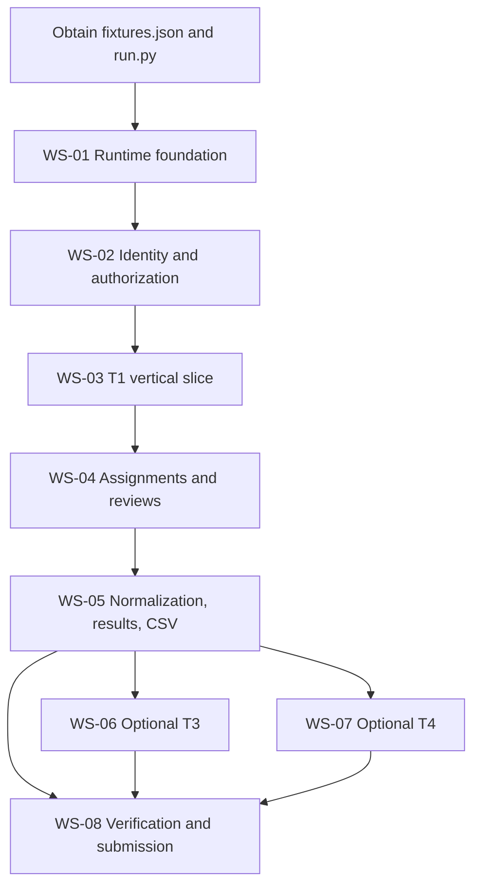

# DOGFOOD Portal — Implementation Plan

## Plan status

| Field | Value |
|---|---|
| Snapshot date | Sunday, September 27, 2026 |
| Code freeze | September 29, 2026 at 18:00 UTC |
| Application implementation in this repository | Not present / not evidenced |
| Requirements baseline | Complete |
| Architecture and domain documentation | Complete at conceptual level |
| Blocking external artifacts | `fixtures.json` and `run.py` are absent |

This plan describes how to implement the source-defined portal. It does not select technologies that remain undecided.

## Implementation objectives

1. Clear the T1 gate before pursuing higher tiers.
2. Deliver a correct T2 judging workflow with backend authorization.
3. Preserve offline, seeded Docker Compose operation throughout development.
4. Make judging calculations reproducible and defensible.
5. Produce honest acceptance evidence and required submission artifacts.
6. Treat T3/T4 as optional scope entered only after T1/T2 are stable.

## Delivery principles

- Correctness over breadth.
- Backend authority over frontend visibility.
- Working vertical slices over isolated UI components.
- Fixture/checker behavior over assumptions.
- Reproducible local operation over hosted convenience.
- Document implemented decisions, not aspirations.
- Keep optional features removable through explicit scope control.

## Blocking inputs and decision gates

### Required source artifacts

| ID | Artifact | Current state | Impact |
|---|---|---|---|
| BLK-001 | `fixtures.json` | Missing | Blocks exact schema, seed validation, edge-case verification, and date-dependent acceptance. |
| BLK-002 | `run.py` | Missing | Blocks exact methods, payloads, response assertions, and final acceptance execution. |

Development can begin using the documented contract, but final acceptance cannot be claimed until both artifacts are available.

### Implementation decisions

| Decision | ADR | Needed before |
|---|---|---|
| Application architecture | ADR-001 | Repository scaffold |
| Database technology | ADR-002 | Schema/migration implementation |
| Authentication mechanism | ADR-003 | Login and checker identities |
| Backend authorization structure | ADR-004 | Protected routes |
| Exact deadline boundary | ADR-005 | Submission acceptance tests |
| Judge assignment strategy | ADR-006 | Assignment engine/dashboard |
| Normalization algorithm | ADR-007 | Results calculation |
| Audit storage/retention | ADR-008 | T3 or expanded provenance |
| API versioning | ADR-009 | T4/API First |
| Offline packaging | ADR-010 | Compose integration |

## Workstreams

### WS-01 — Repository and runtime foundation

**Purpose:** establish a clean, reproducible offline development/runtime environment.

Deliverables:

- application source structure;
- selected OSI license;
- Dockerfile(s) and Compose configuration;
- local persistence and migration mechanism;
- deterministic seed entry point;
- locally served frontend/assets;
- health/readiness behavior;
- initial automated test command.

Exit criteria:

1. A clean checkout starts without application source changes.
2. Core services run locally through `docker compose up`.
3. Networking can be disabled without breaking the application shell.
4. Restart behavior and persistent volumes are understood.

### WS-02 — Identity, roles, and authorization foundation

**Purpose:** implement the security model before sensitive judging routes.

Deliverables:

- participant, judge, and organizer roles;
- event-scoped role resolution or an explicitly documented alternative;
- four fixture/checker identities;
- startup output or documented method for obtaining auth headers;
- centralized backend authorization policy;
- negative role/object tests.

Exit criteria:

1. All four identities authenticate offline.
2. Participant and judge role boundaries are enforced by direct HTTP tests.
3. Authorization is reusable by project, judging, export, and result routes.

### WS-03 — T1 event and submission vertical slice

**Purpose:** clear the mandatory gate.

Deliverables:

- event creation/configuration;
- registration/authentication workflow;
- team formation;
- project creation/submission;
- eligibility representation;
- backend deadline enforcement;
- unauthenticated public gallery;
- fixture projects in the gallery.

Exit criteria:

- AC-T1-001, AC-T1-002, and AC-T1-003 pass when the checker is available;
- direct tests confirm post-close requests do not mutate accepted submission state;
- T1 works after a clean offline restart.

### WS-04 — T2 assignments and review workflow

**Purpose:** implement the core judging experience.

Deliverables:

- judge invitation/identity management;
- assignment and review-batch representation;
- judge assignment list;
- weighted rubric and criterion scoring;
- review lifecycle;
- organizer progress dashboard;
- own-score retrieval;
- peer-score and participant denial.

Exit criteria:

1. Known weighted-score tests pass.
2. Progress agrees with assignment/review records.
3. `judge_b` targeting `judge_a` receives `401` or `403`.
4. Participant cannot retrieve or modify judge records.

### WS-05 — Normalization, results, and CSV

**Purpose:** complete T2 with defensible mathematics and portability.

Deliverables:

- selected normalization algorithm and ADR update;
- zero-variance judge policy;
- missing/incomplete review policy;
- tie policy;
- reproducible result/normalization run;
- raw and normalized result view;
- release-state behavior;
- functioning CSV export.

Exit criteria:

1. Constant-scoring judge cannot produce division-by-zero/NaN.
2. Worked raw-to-normalized example is independently reproducible.
3. Incomplete batches are visible and follow documented publication policy.
4. AC-T2-004 passes when the checker is available.

### WS-06 — Optional T3 public participation

**Entry gate:** all T1/T2 automated checks pass or remaining failures have an explicit, low-risk resolution plan.

Potential deliverables:

- comments;
- community voting;
- hidden results/vote totals until close;
- randomized ballot order;
- anti-abuse controls;
- audit trail and threat model.

Exit criteria depend on manually reviewed source claims. Do not claim T3 if controls are superficial or untestable.

### WS-07 — Optional T4 platform features

**Entry gate:** T1/T2 are stable and submission artifacts are not at risk.

Potential deliverables:

- REST API and OpenAPI;
- signed/retryable webhooks;
- certificates;
- verifiable judge records;
- embeddable gallery;
- bulk import/export.

All contracts and security behavior require decisions before implementation.

### WS-08 — Verification, documentation, and submission

Deliverables:

- `.dogfood.toml`;
- actual `acceptance-report.txt`;
- implementation-aligned README, architecture, data model, and judging documents;
- security/limitations review;
- five-minute demo video;
- final offline clean-checkout rehearsal.

Exit criteria:

1. Tier claims match working behavior.
2. Required documentation agrees with code/configuration.
3. Checker output is committed without alteration.
4. Demo shows one complete lifecycle.

## Dependency graph

## Recommended implementation sequence

1. Record the minimum stack decisions in ADRs.
2. Scaffold application, tests, Compose, persistence, migrations, and license.
3. Implement deterministic seed and checker identities.
4. Build one complete T1 vertical slice before polishing UI.
5. Add centralized backend authorization and its negative tests.
6. Build assignments, rubric/reviews, and progress as a second vertical slice.
7. Select/document normalization and implement result provenance.
8. Implement CSV and execute all T1/T2 checks.
9. Update documentation from actual implementation.
10. Add at most one optional differentiator if the core is stable.
11. Run offline clean-checkout rehearsal and record acceptance output.

## Quality gates

| Gate | Required evidence |
|---|---|
| G-01 — Foundation | Clean Compose startup; local assets/persistence; no mandatory external service |
| G-02 — T1 | Public gallery, fixtures visible, closed-event refusal |
| G-03 — Authorization | Own scores allowed; peer and participant denied in backend |
| G-04 — Judging | Weighted scores, assignments, progress, fixture edge cases |
| G-05 — Results/export | Documented normalization, reproducible results, valid CSV |
| G-06 — Submission | Checker report, docs, license, video, honest tier claims |

## Risk register

| Risk | Probability | Impact | Mitigation |
|---|---|---|---|
| Missing checker/fixture details invalidate assumptions | Unknown | Critical | Obtain artifacts early; isolate checker adapters; avoid hardcoded generated dates. |
| T1 gate incomplete while stretch features consume time | Medium | Critical | Enforce gates; no T3/T4 before T1/T2 stability. |
| Peer-score leakage | Medium | Critical | Central authorization plus direct HTTP matrix tests. |
| Normalization edge cases discovered late | Medium | High | Implement constant/missing/incomplete tests before UI polish. |
| Offline startup depends on remote resources | Medium | High | Network-disabled test from early foundation phase. |
| Documentation diverges from code | Medium | High | Update docs at every gate; final code-doc audit. |
| CSV/checker contract differs from proposal | Unknown | High | Treat `run.py` as authoritative when obtained. |
| Overly ambitious T3/T4 scope | High | High | Maintain explicit kill list and optional entry gates. |

## Scope kill order

If time is insufficient, remove scope in this order:

1. Multiple T4 features.
2. All but one bonus/differentiator.
3. T3 comments/voting enhancements beyond minimum claimed behavior.
4. Nonessential UI polish.

Never cut T1, backend authorization, normalization correctness, CSV acceptance, offline startup, or required submission artifacts.

## Definition of implementation completion

Implementation is complete only when source code/configuration exists, relevant tests pass, acceptance evidence is recorded, and all documentation status statements have been updated from conceptual/TBD to actual behavior.