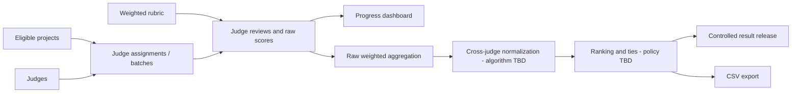

# DOGFOOD Portal — Judging and Scoring Specification

## Status

This document separates mandatory judging behavior from advisory examples. No judging implementation or fixture file is present, so algorithm and schema status remain unverified.

## Normative summary

The source requires:

1. Judge invitation and assignment.
2. Multiple judges per project during the judging window.
3. A weighted scoring rubric.
4. Backend role isolation.
5. A progress dashboard.
6. Cross-judge normalization.
7. Results/ranking as part of the lifecycle.
8. CSV export.
9. Documentation defending assignment, scoring mathematics, and normalization.

The source deliberately does **not** choose the normalization algorithm, score scale, assignment algorithm, tie policy, missing-score policy, or exact CSV schema.

## Judging model

The conceptual flow is:

## Judges

- The shared dataset reportedly contains 30 judges.
- The judging window uses multiple judges per project.
- The dataset intentionally includes a judge who gave everything the same score.
- Judges must be isolated from peer score records.
- Judge expertise, conflict declarations, invitation states, and suspension/revocation rules are not specified.

## Assignments

Source-defined: judges are invited and assigned, and progress is monitored.

Implementation decisions required:

- number of judges per project;
- track expertise matching;
- workload balancing;
- conflict-of-interest representation and enforcement;
- overlap needed for normalization/calibration;
- assignment mutability and reassignment policy;
- batch schema and batch-completion rules.

The advisory source recommends discussing all of these in `JUDGING.md`; it does not prescribe an algorithm.

## Projects and eligibility

Only eligible projects should proceed to judging, but eligibility rules are unknown. The fixtures reportedly include a duplicate submission. The implementation must define whether duplicates are rejected, merged, flagged, or otherwise handled so they do not silently distort assignment or ranking.

## Rubrics and criteria

### Source-defined

- The rubric is weighted.
- Criterion weights must affect score calculation.

### Recommended conceptual fields

- stable criterion identifier;
- label and description;
- numeric scale;
- weight;
- display order;
- rubric version or freeze state.

### Decisions required

- score scale and whether higher is always better;
- numeric precision;
- allowed weights and whether zero weight is valid;
- whether weights must sum to a specific total;
- criterion-comment requirements;
- whether a rubric can change after judging starts;
- versioning/recalculation behavior.

## Raw scores

A raw score is a judge-entered criterion value associated with the judge's assignment/review. Exact storage precision, range, validation, edit history, and finalization behavior are TBD.

## Score validation

At minimum, the implementation must validate scores against the selected criterion scale and authorization policy. The advisory source recommends refusing an empty rubric, defining missing-criterion behavior, and auditing post-submission changes. These are recommendations until adopted.

## Weighted aggregation

The source includes the following **advisory transparent formula**. It is not declared as the only acceptable implementation:

\[
S_i = \frac{\sum_k w_k x_{ik}}{\sum_k w_k},
\]

where criterion \(k\) has weight \(w_k\), and \(x_{ik}\) is the score for project/review \(i\) on criterion \(k\).

Decisions required:

- whether aggregation occurs per review, then per project;
- rounding stage and precision;
- handling of missing criteria and incomplete reviews;
- handling of invalid or voided reviews.

## Cross-judge normalization

### Mandatory behavior

Cross-judge normalization must be implemented and documented. The documentation should show raw and normalized values and explain the method. The hard bonus asks for a demonstrated ranking change and documentation that withstands statistical review.

### Algorithm status

**TBD.** The kickoff material intentionally leaves the algorithm open.

### Advisory z-score example

The source presents judge-wise standardization as one possible method:

\[
z_{ij} = \frac{s_{ij}-\mu_j}{\sigma_j},
\]

where:

- \(s_{ij}\) is judge \(j\)'s score for project \(i\);
- \(\mu_j\) is judge \(j\)'s mean score;
- \(\sigma_j\) is judge \(j\)'s score standard deviation.

This is an example, not a mandated decision.

### Zero-variance judge

The constant-scoring fixture judge has \(\sigma_j=0\) under variance-based normalization. The chosen method must not divide by zero. The source lists possible policies—neutral contribution, exclusion with audit note, or centered-unscaled fallback—but selects none. The final policy must be documented and reproducible.

### Other source-mentioned approaches

- rank/percentile transforms;
- robust centering/scaling;
- calibration through overlapping assignments;
- statistical models;
- pairwise Bradley–Terry ranking as a bonus mode.

The Bradley–Terry model is specified by name only. Its formula, fitting method, priors/regularization, convergence rule, and tie handling are not specified.

## Worked example from the source

Raw scores:

| Project | Judge 1 | Judge 2 | Raw average | Raw rank |
|---|---:|---:|---:|---:|
| Alpha | 90 | 70 | 80.0 | 3 |
| Beta | 80 | 95 | 87.5 | 1 |
| Gamma | 70 | 100 | 85.0 | 2 |

Using population standardization within each judge:

| Project | Judge 1 z | Judge 2 z | Mean z | Normalized rank |
|---|---:|---:|---:|---:|
| Alpha | 1.225 | -1.397 | -0.086 | 2 |
| Beta | 0.000 | 0.508 | 0.254 | 1 |
| Gamma | -1.225 | 0.889 | -0.168 | 3 |

The example changes the Alpha/Gamma ordering. It demonstrates transparency; it does not establish z-score normalization as the project decision.

## Ranking

Ranking is required as part of results. The following are TBD:

- whether rank is global, per track, or both;
- ascending/descending conventions;
- normalization aggregation across unequal review counts;
- minimum review coverage;
- tie representation;
- deterministic secondary keys;
- provisional/final states.

Opaque database order must not become an undocumented tie-break (recommended).

## Ties

No tie policy is source-defined. Options mentioned in advisory material include shared rank, documented secondary criteria, additional judging, or an explicit tie-break bonus. A decision is required before implementation and tests are complete.

## Incomplete reviews and missing scores

The fixture dataset reportedly includes two unfinished review batches. The system must expose progress and define whether incomplete judging prevents final publication or produces a provisional result. Missing values must not silently become zero unless that is an explicit, defended policy.

Potential tension in the source: the fixture set is described as having a “full set of scores” while also containing unfinished batches. Without `fixtures.json`, the exact distinction between available score records and incomplete assignment/batch state cannot be resolved.

## Result release

Tier 3 requires results to remain hidden until the applicable window closes. Release checks must apply to every result surface, including UI, API, exports, and embeds when implemented. The exact release timestamp field and organizer override behavior are TBD.

## Result provenance and reproducibility

Recommended result-run fields:

- event and rubric version;
- included projects, assignments, reviews, and scores;
- algorithm name/version;
- parameters;
- missing-score and zero-variance rules;
- initiating actor and timestamp;
- raw aggregates, normalized values, ties, and final order;
- warnings/exclusions.

These fields are recommended because opaque normalization is a core problem, but their persistence schema is not mandated.

## Authorization invariants

1. A judge may retrieve personal score records.
2. `judge_b` requesting `judge_a` records must receive `401` or `403`.
3. A participant must be blocked from judge-only behavior/data.
4. UI hiding does not satisfy these invariants; enforcement belongs in the backend.

See [AUTHORIZATION.md](AUTHORIZATION.md).

## Edge cases

| Edge case | Required/decision status |
|---|---|
| Constant-scoring judge | Must be handled by chosen normalization; exact policy TBD |
| Two unfinished review batches | Must remain visible; ranking/publication policy TBD |
| Duplicate submission | Must not silently distort judging; exact policy TBD |
| Unequal judge coverage | Not specified; method must document behavior |
| Missing criterion | Not specified; policy required |
| Rubric edited after scores | Not specified; freeze/version recommendation |
| Judge reassigned after partial review | Not specified |
| Exact tie | Not specified |
| Judge collusion | Threat-model concern; detection/mitigation TBD |

## Judging acceptance and tests

| Requirement | Test |
|---|---|
| Weighted rubric | TC-JUD-001 known weighted calculation |
| Own scores | TC-AUTHZ-001 |
| Peer isolation | TC-AUTHZ-002 / AC-T2-002 |
| Participant blocked | TC-AUTHZ-003 / AC-T2-003 |
| Progress dashboard | TC-JUD-002 compare assignments/review states |
| Constant judge | TC-JUD-003 |
| Incomplete batches | TC-JUD-004 |
| Raw-to-normalized reproducibility | TC-JUD-005 |
| Ties/missing scores | TC-JUD-006/007 after policy selection |

## Required decisions before implementation can be called complete

Assignment strategy, conflict handling, rubric scale/precision, review lifecycle, missing-score policy, normalization algorithm, zero-variance policy, unequal-coverage policy, tie policy, result release semantics, organizer override, and provenance persistence.