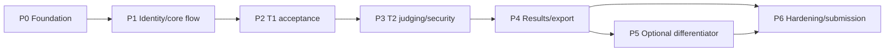

# DOGFOOD Portal — Phase-Wise Delivery Plan

## Planning basis

This is a compressed execution plan anchored to the source deadline.

| Milestone | UTC date/time |
|---|---|
| Snapshot | September 27, 2026 |
| Code freeze/submission | September 29, 2026 at 18:00 UTC |
| Judging | September 29–October 8, 2026 |
| Teardown closes | October 5, 2026 at 18:00 UTC |
| Results | October 9, 2026 |

No portal code is present in this repository at the snapshot date. The schedule below is therefore a recovery-oriented recommendation, not a report of work already performed.

## Phase overview

| Phase | Scope | Tier | Exit gate | Current evidence status |
|---|---|---|---|---|
| P0 | Inputs, decisions, repository foundation | Gate | Buildable local scaffold | Not evidenced |
| P1 | Seed, identity, roles, event/team/project flow | T1 | Working vertical slice | Not evidenced |
| P2 | Public gallery and deadline acceptance | T1 | Three T1 checks | Not evidenced |
| P3 | Assignments, rubric, reviews, authorization | T2 | Security/judging gate | Not evidenced |
| P4 | Normalization, results, CSV | T2 | Four T2 checks | Not evidenced |
| P5 | Optional differentiator | T3/T4/bonus | Core remains green | Not evidenced |
| P6 | Hardening, documentation, demo, submission | All claimed | Freeze-ready evidence | Documentation baseline complete; implementation evidence absent |

## P0 — Inputs, decisions, and foundation

### Objectives

- Obtain `fixtures.json` and `run.py`.
- Select the minimum implementation stack.
- Update ADR-001, ADR-002, ADR-003, and ADR-010.
- Add license, application scaffold, tests, Dockerfile(s), Compose, migrations, and local assets.

### Deliverables

- clean startup shell;
- local persistence;
- health/readiness baseline;
- seed/test command placeholders wired into the runtime;
- development/test commands documented.

### Exit criteria

- application builds and starts through Compose;
- no mandatory remote service is required;
- first automated test runs;
- critical input artifacts are available or explicitly escalated.

## P1 — Identity, roles, and core event flow

### Objectives

- Implement registration/authentication and event-scoped roles.
- Create four checker identities and output their auth headers.
- Implement event creation, teams, project draft/submission, and eligibility representation.

### Exit criteria

- organizer, `judge_a`, `judge_b`, and participant authenticate offline;
- event/team/project records persist;
- participant cannot access organizer/judge actions in direct HTTP tests.

## P2 — T1 acceptance gate

### Objectives

- Load exact fixtures.
- Preserve `submissions_close`.
- Expose anonymous gallery.
- Display fixture projects.
- Enforce closed-event refusal in backend.

### Exit criteria

- AC-T1-001 passes;
- AC-T1-002 passes;
- AC-T1-003 passes;
- clean offline restart still passes T1.

No T3/T4 work begins before this gate.

## P3 — T2 assignments, reviews, and isolation

### Objectives

- Select/document assignment strategy.
- Implement judge assignments/review batches.
- Implement rubric criteria and weighted scoring.
- Implement judge review states and progress dashboard.
- Enforce own-score access, peer denial, and participant denial.

### Exit criteria

- weighted-score unit tests pass;
- dashboard matches assignment/review data;
- AC-T2-001 passes;
- AC-T2-002 returns exact 401/403;
- AC-T2-003 passes;
- frontend bypass attempts remain denied.

## P4 — T2 normalization, results, and export

### Objectives

- Decide normalization, zero-variance, missing-score, incomplete-batch, and tie policies.
- Implement reproducible result runs.
- Show raw and normalized output.
- Implement release controls.
- Implement and validate CSV export.

### Exit criteria

- constant-scoring judge handled without invalid math;
- unfinished batches follow documented policy;
- duplicate submission follows documented policy;
- independent recomputation matches stored results;
- AC-T2-004 passes;
- all seven acceptance checks are green or remaining failures are honestly documented.

## P5 — Optional differentiator

### Entry criteria

- T1 is green.
- T2 is stable.
- Required documentation and demo work have protected time.

### Options

Choose at most one primary differentiator:

1. Normalization Proof.
2. Pairwise Bradley–Terry mode.
3. Threat Model/T3 anti-abuse.
4. API First/OpenAPI.

Avoid partial implementation of all options.

### Exit criteria

- differentiator works end to end;
- core acceptance remains green;
- limitations are documented;
- differentiator can be removed without destabilizing submission.

## P6 — Hardening and submission

### Objectives

- execute full tests and offline rehearsal;
- update all documentation from actual code/configuration;
- create `.dogfood.toml`;
- commit actual `acceptance-report.txt`;
- produce five-minute demo;
- verify OSI license and honest tier claims.

### Exit criteria

- clean-checkout `docker compose up` succeeds;
- network-off T1/T2 workflows succeed;
- source, configuration, docs, report, and video agree;
- freeze package is ready before September 29 at 18:00 UTC.

## Recommended remaining-time schedule

The following schedule is a recommendation anchored around the September 27 snapshot; adjust to actual team capacity and artifact availability.

| UTC window | Focus | Non-negotiable outcome |
|---|---|---|
| Sep 27 morning | P0 decisions and scaffold | Compose/application/test foundation |
| Sep 27 afternoon–evening | P1 identity and T1 event/project flow | Persistent vertical slice and four auth headers |
| Sep 27 night–Sep 28 morning | P2 T1 acceptance | Three T1 checks green |
| Sep 28 daytime | P3 judging and authorization | Own-score access; peer/participant denial; weighted reviews |
| Sep 28 evening–Sep 29 early | P4 normalization/results/CSV | Defensible math and four T2 checks |
| Sep 29 morning | P6 tests/docs/config/report | Clean offline rehearsal and truthful documents |
| Sep 29 early afternoon | Demo and targeted fixes | Five-minute lifecycle and final report |
| Sep 29 15:00–18:00 | Freeze buffer | No new scope; submission integrity only |

## Phase dependency diagram

## Phase review questions

At every phase boundary ask:

1. What source requirement became demonstrably true?
2. What direct test proves it?
3. What artifact/configuration changed?
4. What documentation must be updated?
5. What newly discovered risk or decision blocks the next phase?
6. Can optional scope be removed while retaining the completed gate?

## Post-freeze phases

### Judging support: September 29–October 8

- preserve submitted state and evidence;
- respond to evaluator questions;
- do not misrepresent post-freeze changes;
- prepare a concise explanation of architecture and judging choices.

### Teardown: by October 5 at 18:00 UTC

- document schema/normalization/authorization lessons;
- explain features cut and unresolved weaknesses;
- publish an insight-focused write-up.

### Adoption readiness: after results

- triage organizer feedback;
- turn proposed ADRs into accepted/rejected decisions;
- establish maintenance, security update, release, migration, and support policies.