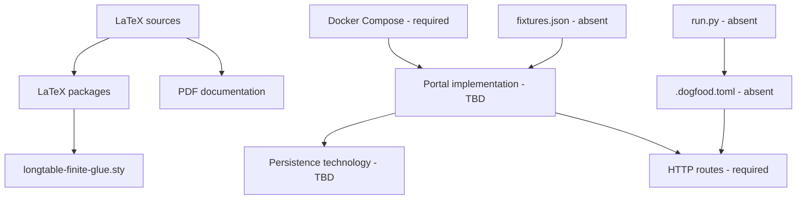

# DOGFOOD Portal — Technology Stack

## Status

No hackathon portal implementation is present in the supplied repository. The files establish a documentation build stack and runtime constraints, but they do not establish an application framework, programming language, database, ORM, frontend framework, authentication library, or cloud provider.

## Confirmed technologies

These technologies are evidenced by repository files or explicit source requirements.

| Technology | Version | Purpose | Where used | Dependency relationship | Selection reason | Status |
|---|---|---|---|---|---|---|
| LaTeX | Not pinned | Author the participant handbook/specification | `main.tex`, `proofrank_solution.tex`, `proofrank_appendix.tex` | Uses the listed LaTeX packages | Not documented | Confirmed documentation technology |
| pdfTeX / `pdflatex` | Not pinned in source | Produce PDF documentation | `main.pdf`, `proofrank_solution.pdf` | Processes LaTeX sources | Not documented | Confirmed by generated artifacts/tooling; not an application technology |
| `article` document class | LaTeX-provided | Document layout | LaTeX sources | Base class for packages | Not documented | Confirmed |
| `longtable` | Not pinned | Multi-page tables | LaTeX sources | Patched by `longtable-finite-glue.sty` | Required by document structure | Confirmed |
| `longtable-finite-glue.sty` | Repository package dated 2026-09-27 | Replace infinite shrink glue in the installed `longtable` output routine | Documentation build | Requires `etoolbox`; patches `\LT@output` | Comment states compatibility with the finite-glue change adopted upstream in `longtable` v4.25 | Confirmed local package |
| TikZ, `tcolorbox`, `tabularx`, `booktabs`, `listings`, `hyperref`, `fancyhdr`, `titlesec`, `xcolor`, `enumitem`, `microtype`, `pifont`, `lastpage` | Not pinned | Document diagrams, tables, code blocks, links, and styling | LaTeX sources | LaTeX package dependencies | Not documented | Confirmed documentation dependencies |
| Docker Compose | Version not specified | Required application startup interface | Required future portal repository | Must start the seeded portal with `docker compose up` | Source-defined evaluator/operator contract | Required; configuration absent |
| Python 3 standard library | Version not specified | Execute the organizer-supplied acceptance checker | External `run.py` | Reads `.dogfood.toml` and calls portal routes | Same checker for every team | Required external tooling; file absent |
| TOML | Version not specified | Acceptance-checker configuration | Required `.dogfood.toml` | Parsed by `run.py` | Allows arbitrary application routes/auth mechanisms | Required configuration format; file absent |
| CSV | Dialect/encoding not specified | T2 export | Configured export route | Consumed by checker and organizers | Portability requirement | Required format; schema absent |
| HTTP | Version not specified | Checker-to-portal and future API communication | Configured base URL/routes | Carries supplied authentication header | Implied by example URLs/routes and status codes | Required interface; implementation absent |

## Implementation technologies

No application implementation technologies are established. Repository inspection found no source-code directories, package manifests, Dockerfile, Compose file, migration files, database schema, environment configuration, or executable checker.

| Category | Established implementation | Status |
|---|---|---|
| Backend language/framework | None | Implementation decision required |
| Frontend language/framework | None | Implementation decision required |
| Database | None | Implementation decision required |
| ORM/query layer | None | Implementation decision required |
| Authentication library | None | Implementation decision required |
| Session/token format | Example uses a cookie header, but mechanism is intentionally open | Implementation decision required |
| API framework | None | Implementation decision required |
| Webhook implementation | None | Planned Tier 4 only |
| Object/file storage | None | Implementation decision required; must work offline |
| Test framework | None | Implementation decision required |
| CI platform | None | Implementation decision required |
| Logging/metrics stack | None | Implementation decision required |
| License | OSI approval required; MIT or Apache-2.0 preferred | Selection required |

## Source recommendations that are not technology decisions

The advisory material recommends a modular monolith, one relational database, local assets, server-side sessions or locally verifiable tokens, and deterministic seeding. These are recommendations, not confirmed implementation facts or accepted ADRs.

## Undecided technology criteria

Any selected stack must satisfy the following source-defined constraints:

1. Starts through Docker Compose.
2. Runs on a laptop with networking disabled.
3. Does not require a hosted database, hosted authentication provider, or cloud account.
4. Enforces roles and object ownership in the backend.
5. Supports deterministic fixture loading and the configured checker routes.
6. Can implement weighted scoring, normalization, CSV export, and documented APIs where claimed.

## Dependency graph

## Open technology decisions

See [DOCUMENTATION_AUDIT.md](DOCUMENTATION_AUDIT.md), especially OQ-001 through OQ-010. Technology selections must be recorded in ADRs before this document can claim an implemented stack.