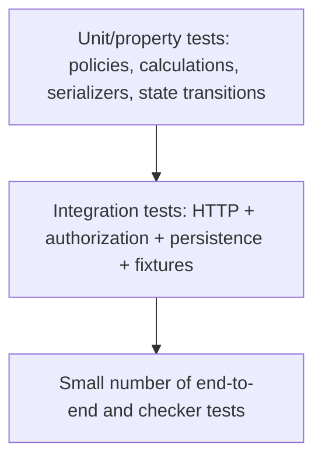

# DOGFOOD Portal — Testing Strategy

## Status

No application code, test framework, CI configuration, `run.py`, Docker Compose file, or fixture JSON is present. This strategy defines the required verification coverage and leaves framework-specific implementation TBD.

## Testing objectives

1. Prove T1 gate behavior before higher tiers.
2. Prove backend role and object-level isolation.
3. Prove closed-event enforcement uses authoritative fixture time.
4. Prove judging mathematics and edge-case behavior are reproducible.
5. Prove offline startup and operation.
6. Prove exports are valid and appropriately authorized.
7. Preserve honest evidence through `acceptance-report.txt`.

## Test pyramid

Exact proportions and frameworks are implementation-defined.

## Unit testing

Recommended unit targets:

- deadline comparison and boundary semantics;
- role/ownership policy functions;
- rubric validation and weighted calculation;
- normalization including zero variance;
- tie/missing-score behavior after decisions;
- result-release state;
- CSV quoting/formula protection;
- webhook signature/replay/idempotency if T4;
- seed deduplication/stable IDs.

## Integration testing

Exercise authenticated HTTP requests against real persistence and seeded fixtures. Include every role/resource combination, event-state transitions, result calculation, CSV parsing, and restart persistence.

## API testing

Until `run.py` and implementation paths exist, methods and schemas are TBD. Future tests must cover success/error schemas, validation, pagination/filtering if added, idempotency, API versioning, and OpenAPI conformance.

## Authorization testing

Run a role matrix rather than testing only happy paths:

- anonymous gallery access;
- participant judge-route denial;
- judge own-score access;
- judge peer-score denial with exact 401/403;
- cross-team identifier substitution;
- judge organizer-action denial;
- cross-event access denial if event scoping is adopted;
- direct HTTP calls to frontend-hidden actions.

## Security testing

See [SECURITY.md](SECURITY.md). Include input fuzzing/validation, information-disclosure faults, secret scanning, CSV formula values, pre-release result enumeration, rate/ballot abuse for T3, and webhook signature/replay for T4.

## Database testing

Database technology is TBD. Required future coverage includes constraints, transactions, migrations, rollback, concurrent updates where relevant, seed idempotency, and preservation of result provenance. Do not write database-specific tests until a decision exists.

## Fixture testing

Blocked until `fixtures.json` is supplied. Required scenarios are listed in [FIXTURES.md](FIXTURES.md), including counts, exact close time, constant judge, incomplete batches, and duplicate submission.

## Offline testing

1. Use a clean checkout/cache state appropriate for evaluator assumptions.
2. Start through `docker compose up`.
3. Disable outbound networking.
4. Load every page/asset used in T1/T2 workflows.
5. Authenticate all four identities.
6. Run the checker.
7. Restart and verify persistence/idempotency.

External CDNs, hosted identity, hosted database, and mandatory remote APIs must not be required.

## Acceptance testing

The seven official checks are specified in [ACCEPTANCE.md](ACCEPTANCE.md). `run.py` is the authoritative executable acceptance suite when available.

| Acceptance ID | Primary test ID |
|---|---|
| AC-T1-001 | TC-T1-001 |
| AC-T1-002 | TC-T1-002 |
| AC-T1-003 | TC-T1-003 |
| AC-T2-001 | TC-AUTHZ-001 |
| AC-T2-002 | TC-AUTHZ-002 |
| AC-T2-003 | TC-AUTHZ-003 |
| AC-T2-004 | TC-CSV-001 |

## Regression testing

Every fixed issue affecting authorization, deadline enforcement, normalization, duplicate/incomplete fixtures, CSV, or offline startup should gain a repeatable regression test. Acceptance output should be regenerated before release/submission.

## Edge-case testing

- exactly at the submission close boundary;
- clock/timezone differences;
- empty rubric and invalid weights;
- minimum/maximum score;
- missing criterion/review;
- constant-scoring judge;
- unequal review counts;
- unfinished batches;
- duplicate submission;
- exact ties;
- large/quoted/multiline CSV fields;
- formula-like CSV text;
- revoked/invalid header;
- target identifiers belonging to another role/team/event.

## Failure testing

Inject persistence failure, malformed fixture/configuration, unavailable local dependency, invalid auth header, normalization error, export serialization failure, and webhook failure if applicable. Ensure errors are visible to operators and sanitized for users.

## Test data

Primary required test data is `fixtures.json`, currently absent. Additional minimal synthetic cases may test algorithms/policies but must not replace fixture-dependent acceptance tests.

## Test environment

| Environment | Required characteristics |
|---|---|
| Developer | Local, implementation-specific tooling TBD |
| Integration | Real local persistence and seeded fixtures |
| Acceptance | Docker Compose portal + `.dogfood.toml` + `run.py`, network disabled where practical |
| Security | Role-specific credentials and direct HTTP client |
| Release | Clean checkout and empty persistent volumes/state |

## CI testing

No CI platform is selected. A future pipeline should run formatting/linting, unit tests, integration tests, OpenAPI validation, fixture validation, offline build verification where feasible, and the acceptance checker. CI must not be documented as existing until configured.

## Release verification

1. Confirm license and required documents.
2. Build/start from clean checkout.
3. Verify no mandatory outbound dependency.
4. Verify fixture counts/time/edge cases.
5. Run unit/integration/security tests.
6. Run `run.py .dogfood.toml`.
7. Commit actual `acceptance-report.txt`.
8. Rehearse five-minute lifecycle demo.
9. Record honest limitations.

## Test-case matrix

| Test ID | Requirement | Scenario | Expected result | Type |
|---|---|---|---|---|
| TC-OPS-001 | NFR-001 | Clean `docker compose up` | Seeded portal becomes usable | E2E |
| TC-OPS-002 | NFR-002/003 | Disable network and use T1/T2 | Core workflows remain usable | E2E |
| TC-FIX-001 | FR-009/TR-030 | Load fixtures | Reported fixture data present | Integration |
| TC-FIX-002 | NFR-008/TR-029 | Inspect event close | Exact fixture `submissions_close` preserved | Integration |
| TC-T1-001 | FR-008 | Anonymous gallery request | Gallery accessible | Acceptance/API |
| TC-T1-002 | FR-009 | Search gallery for fixture projects | Projects shown | Acceptance/E2E |
| TC-T1-003 | FR-007 | Submit after close | Refused; state not accepted | Acceptance/API |
| TC-AUTHZ-001 | FR-012 | Judge requests own scores | Allowed | Acceptance/API |
| TC-AUTHZ-002 | FR-013 | `judge_b` requests `judge_a` scores | 401 or 403; no data | Acceptance/Security |
| TC-AUTHZ-003 | FR-014 | Participant requests judge behavior/data | Denied | Acceptance/Security |
| TC-AUTHZ-004 | NFR-004 | Call hidden action directly | Backend still denies | Security |
| TC-AUTHZ-005 | TR-027 | Substitute another team/project ID | Denied under adopted ownership policy | Security |
| TC-JUD-001 | FR-011 | Known criterion values/weights | Matches documented aggregation | Unit |
| TC-JUD-002 | FR-015 | Compare dashboard to assignments | Correct completion counts/states | Integration |
| TC-JUD-003 | FR-016 | Normalize constant-scoring judge | No divide-by-zero; documented policy | Unit/Integration |
| TC-JUD-004 | FR-015/017 | Incomplete review batches | Visible; result policy applied | Integration |
| TC-JUD-005 | NFR-005 | Recompute normalized result | Matches documented method | Unit/Review |
| TC-JUD-006 | TR-039 | Exact tie | Documented tie policy | Unit |
| TC-JUD-007 | TR-035/039 | Missing criterion/review | Documented missing policy | Unit |
| TC-CSV-001 | FR-018 | Call configured export | Valid parseable CSV | Acceptance/Integration |
| TC-CSV-002 | TR-043 | Formula-like cell | Protected per documented policy | Security |
| TC-T3-001 | FR-021 | Request results before close | Hidden across surfaces | Integration/Security |
| TC-T3-002 | FR-022 | Generate repeated ballots | Order is randomized under selected design | Statistical/Integration |
| TC-T3-003 | FR-023 | Repeated/abusive votes | Control/audit behavior visible | Security |
| TC-T4-001 | FR-024 | Compare UI actions with OpenAPI | Every claimed action documented | Contract |
| TC-T4-002 | TR-044 | Forge/replay webhook | Invalid/replayed delivery handled per policy | Security |
| TC-DOC-001 | DR-005–DR-008 | Review documents vs implementation | No unsupported claims | Review |
| TC-ACCEPT-001 | FR-030 | Run official checker | Report committed unchanged/honestly | Acceptance |

## Coverage gaps

All implementation-dependent tests are currently unimplemented. Exact checker payload/status coverage, fixture schema tests, framework security tests, and migration tests remain blocked by missing source artifacts and technology decisions.